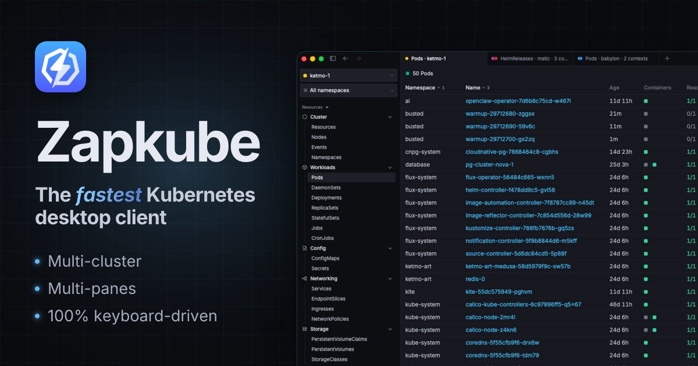

<h1 align="center">Zapkube</h1>

  <strong>The fastest Kubernetes desktop client.</strong> 
  Connect to all your clusters from a lightweight, multi-tabs, multi-panes & keyboard-friendly UI.

  <a href="https://zapkube.com/download">Download</a> ·
  <a href="https://zapkube.com">Website</a> ·
  <a href="https://github.com/zapkube/zapkube/releases/latest">Releases</a> ·
  <a href="https://discord.gg/qZ5bq7EKHY">Discord</a> ·
  <a href="https://github.com/zapkube/zapkube/issues">Issues</a>

---

Most Kubernetes tools are slow to use on a daily basis. Zapkube is built by engineers obsessed
with CLI tools who still wanted an efficient GUI to speed up their daily workflow: get a global
overview of your cluster in a keystroke, so everything feels blazing fast.

## Features

- 🗂️ **Multi-tabs & split views** — unlimited tabs, split into horizontal or vertical panes.
- 🌐 **Multi-cluster, simultaneously** — one tab, several clusters, a single unified view.
- ⌨️ **Keyboard-first** — 100% usable without a mouse, plus a command palette for the rest.
- 📜 **Smart log viewer** — every matching pod merged into one live feed, JSON and logfmt parsed.
- 🔌 **Port-forward on steroids** — saved favorites, auto-reconnect, shareable configs.
- 🧩 **Scheduler simulator** — find out exactly what keeps a pod unschedulable.
- 📊 **Pod & node usage metrics** — live CPU and memory against requests and limits.
- 🚀 **Helm & GitOps (Flux and Argo CD)** — releases, revisions and sync state, in app.
- 💻 **kubectl-compatible CLI** — same flags you already know, deep-linked to any view.
- 🎉 **Zero-config setup** — if `kubectl` works on your machine, so does Zapkube.
- ⚡️ **Native, not another Electron app** — built in Go, compiled and light.
- ✅ **Works with any cluster** — GKE, EKS, AKS, OpenShift, Talos, Rancher, on-prem…

Visit [zapkube.com](https://zapkube.com) to see it in action.

## Download

| Platform | Formats |
| --- | --- |
| **macOS** | `.dmg`, `.zip` — universal binary (Apple Silicon & Intel) |
| **Linux** | `.deb`, `.rpm`, `AppImage`, Arch — x86-64 & arm64 |
| **Windows** | Coming soon |

👉 **[Download the latest version](https://zapkube.com/download)** — or grab the assets and release
notes directly from [GitHub Releases](https://github.com/zapkube/zapkube/releases/latest).

## Roadmap

Zapkube ships continuously. A few things in the works:

- Traffic & topology graphs
- Prometheus metrics
- Audit scan
- Image Filesystem browser
- Cert-Manager support
- Built-in terminal
- AI integration
- etc

The living roadmap is on [zapkube.com](https://zapkube.com#roadmap).

## About this repository

Zapkube is **not open source** (yet). This repository is used for **releases**, **issue tracking** and
**feature requests** only — there is no source code here.

## Need help?

- 🐛 Found a bug or have an idea? [Open an issue](https://github.com/zapkube/zapkube/issues/new/choose)
- 💬 Join the community on [Discord](https://discord.gg/qZ5bq7EKHY)
- ✉️ Reach out via the [contact page](https://zapkube.com/contact)

---

  ❤️ Enjoying Zapkube? Star this repo and tell a colleague.

